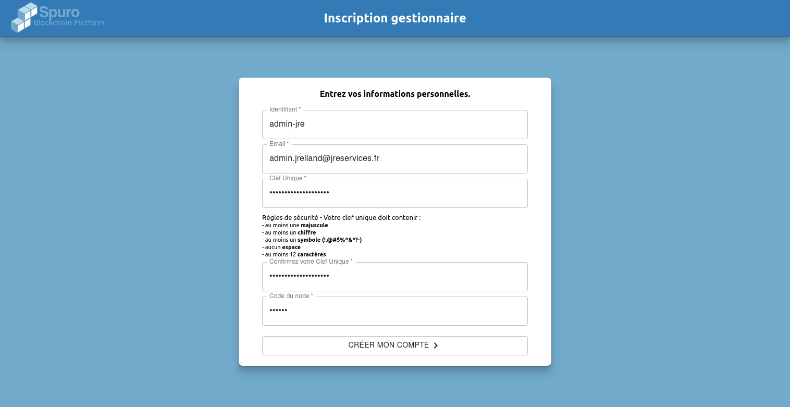
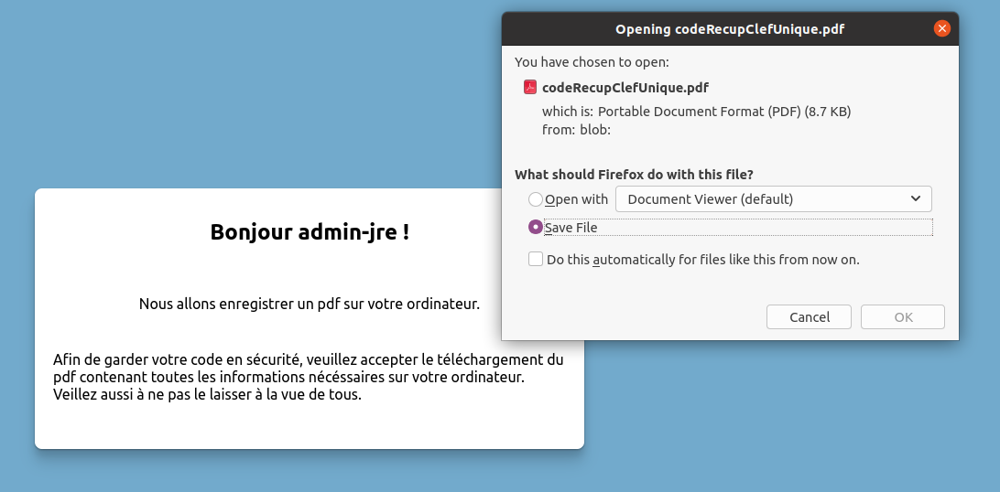
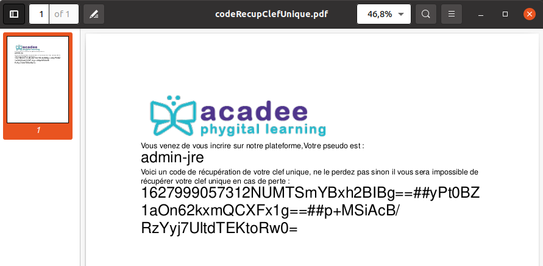
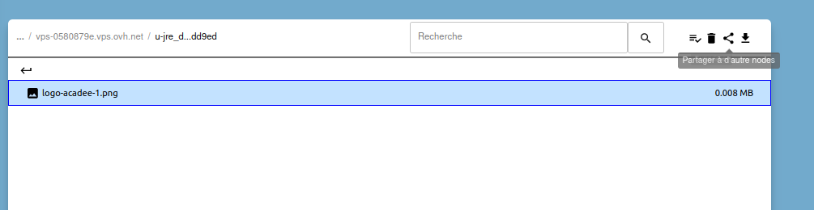

# À supprimer - Notes

## âches

* [ ] Point sur les versions
* [ ] Règles du jeu à améliorer
* [ ] Vocabulaire et sigles
* [ ] Revoir les rôles pour faire les transferts

## Nouvelle plateforme

L'écran

Le contenu du courriel à la création

> **Bonjour,**
>
> Vous venez de vous inscrire sur notre plateforme,
>
> Votre identifiant est : admin-jre
>
> Voici un lien vous permettant de télécharger un code de récupération de clef unique, ne le perdez pas sinon il vous sera impossible de récupérer votre clef unique en cas d'oubli : [code de récupération](http://vps-883960cf.vps.ovh.net/RecupCodeClefUnique?link=1627998071878836429&s=A)
>
> Cordialement.
>
> 0102030405 - b.faraggi@spuro.eu
>
> 9 Rue Gustave Eiffel 10430 Rosières-Près-Troyes

## Code de récupération de la clé unique

Lors de la création du gestionnaire, un courriel est envoyé pour la confirmation.

Ce courriel contient un lien pour télécharger un PDF qui contient le code de récupération de ce compte dans le cas où votre clé unique serait perdu. PDF à conserver dans un endroit sûr. Le code peut être recopié dans votre gestionnaire de mots de passe.

Le code est envoyé dans un PDF

### Test images

Insertion d'image du serveur, glisser :  pas modifiable !

Avec la commande Image accessible à partir du curseur !

Insert palette et la commande palette !

  

