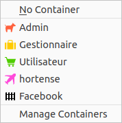
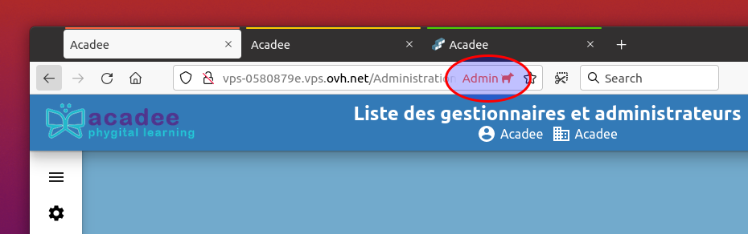

# Généralités sur les acteurs de la blockchain

Dans une blockchain, d'une manière générale, quatre rôles sont identifiés, des rôles les plus étendus aux rôles les plus faibles :

* L'**administrateur**. Ils administrent, au niveau de la blockchain, les serveurs et tous les aspects techniques. L'administrateur a accès à l'ensemble des nodes. Il est possible d'imaginer des administrateurs locaux. L'administrateur dispose des droits pour tenir le rôle de gestionnaire et d'utilisateur. L'administrateur peut être déclaré validateur si il a été déclaré en temps que tel.
* Le **gestionnaire**. Ils administrent la blockchain d'un point de vue fonctionnel. Le gestionnaire créé les utilisateurs \(le clients\) et autorisent certaines applications. Un gestionnaire administre son node. Il est possible d'imaginer des gestionnaires globaux à la blockchain. Le gestionnaire a aussi un rôle d'utilisateur.
* Les **utilisateurs**. En fait, ce sont les **clients** de la blockchain. En fonction des droits d'accès accordés par le gestionnaire, l'utilisateur va "consommer" les services de la blockchain.
* Les **validateurs** ou **vérificateurs**. Le gestionnaire créé spécifiquement des vérificateurs, dans le cadre de la Gestion de preuve, pour la vérification de document dans le cadre d'un processus d'authentification de documents. Un gestionnaire ou un utilisteur peut-être aussi déclaré comme validateur.

Chacun de ces acteurs disposeront, pour accéder à la blockchain, d'un identifiant et d'une clé unique. Ces identifiants seront à conserver, idéalement dans un wallet ou un gestionnaire de mots de passe.

Une fois connecté, l'acteur dispose d'un hash unique, et un seul, qui permet d'identifier l'individu dans les registres de la blockchain. Ce hash sera demandé dans certaines transactions de la blockchain comme Propose un contrat.

Avec la commande Tokens &gt; Mon empreinte, il est possible d'afficher son hash. Exemple de d'identification avec le hash

Si vous êtes amené à vous identifier pour plusieurs rôles \(comme par exemple dans un bac à sable pour découvrir la blockchain dans différents rôles\), il est recommandé de mettre une lettre devant votre nom pour spécifier le rôle. Exemple : a-john \(ou admin-john\) ; g-john \(ou gest-john\) ; u-john \(ou util-john\) ; v-john \(ou val-john\).

Pour ouvrir en simultané tous ces rôles dans le même navigateur, nous vous recommandons d'utiliser le navigateur Firefox et l'extension : Container Tabs. Cette extension de Firefox permet d'ouvrir des comptes différents d'un même site web dans des onglets différents. Ces rôles peuvent etre facilement identifiés dans les onglets.

