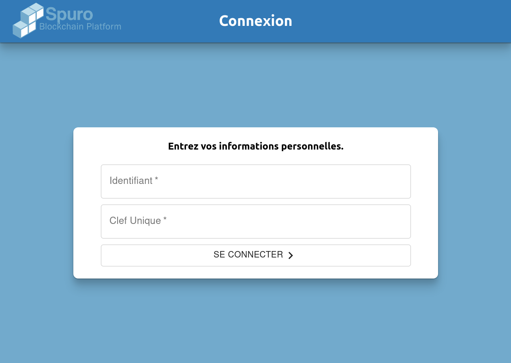
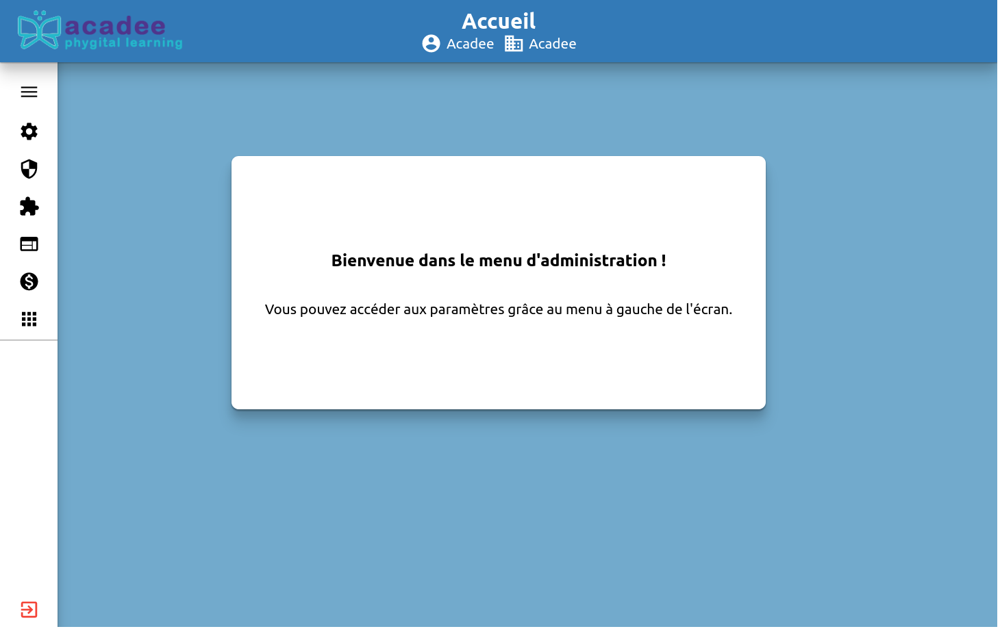
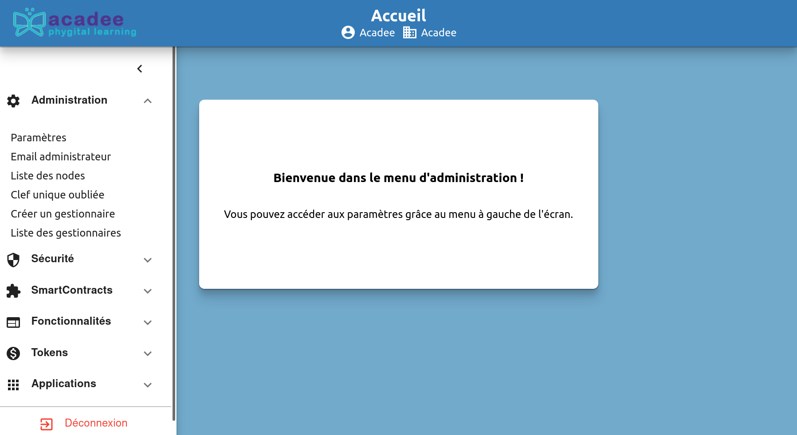

# Administration de la plateforme

## Connexion à la plateforme Blockchain en tant qu'administrateur


Votre identifiant et votre clé unique vous donne le statut sur une plateforme. Si ces identifiants sont ceux d'un administrateur, vous entrerez dans la plateforme comme admnistrateur. 


Pour se connecter, rendez-vous à l'url de la plateforme qui vous a été communiqué. Cette url est de la forme : `http://vps-05xxxx9e.vps.ovh.net/ConnexionAdmin`

Entrer votre identifiant et la "Clé unique" qui vous ont été communiqués.


Une `Clé unique` n'est pas un mot de passe que l'on peut redemander en ligne \(Voir les Généralités\). Si vous avez perdu votre `clé unique`, contacter l'administrateur de la plateforme concernée.



À noter que dans le bandeau supérieur, il apparaît : Le logo de Acadee-Formation, l'identifiant de la personne connectée et la nom de la blockchain.


Une fois que vous avez entré les identifiants d'administrateur, vous accéder au panneau d'administration. Le menu principal est sur la gauche.

Pour détailler chaque sous-menu, Cliquer sur le chevron pointé vers bas en vis à vis de chaque item. 

Pour masqué le menu de gauche, cliquer sur le chevron orienté vers la gauche. Des icônes apparaissent. Cliquer sur le "sandwich" \(les 3 traits horizontaux\) pour faire apparaîtr le menu général.

## Le sous-menu Administration

Pour faire apparaître le sous-meunu `Administration`, cliquer sur le chevron pointé vers le bas en vis à vis de cet idem. Le chevron pointe désormais vers haut. Pour refermer le sous-menu, cliquer à nouveau sur ce chevron.


Bien qu'il apparaît une commande `Clé unique oubliée`, vous êtes invité à bien conserver votre clé unique.


## Présentation générale du sous-menu `Administration`

Les commandes de ce sous-menu seront vues en détail ultérieurement. Il est proposé ici une présentation générale.

1. **Paramètres** : Il s'agit des paramètres de votre compte d'administrateur. Permet le changement : des mots de passe de l'administrateur et du gestionnaire, du nom de l'entreprise, de la valeur du STC ainsi que des variable du compte SMTP \(Courriel\).
2. **Email administrateur**: Permet de modifier le courriel de l'administrateur ainsi que d'envoyer des messages directs aux administrateurs des autres nodes.
3. **Liste des nodes** : Le liste exhaustive des nodes de cette blockchain apparaît
4. **Clé unique oubliée** : Sera abordé ultérieurement.
5. **Créer un gestionnaire** : Création du gestionnaire par l'administrateur.
6. Liste des Gestionnaires : Vue sur l'ensemble des gestionnaires déclarés sur cette blockchain.

