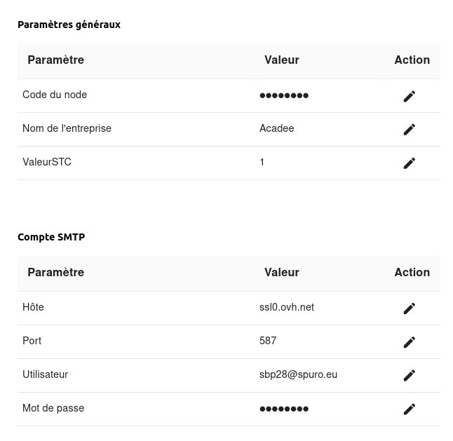
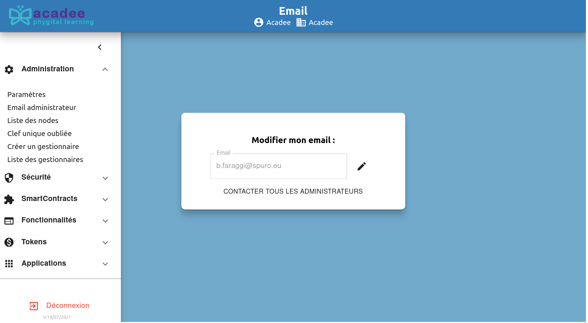
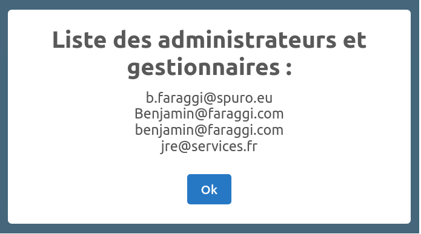
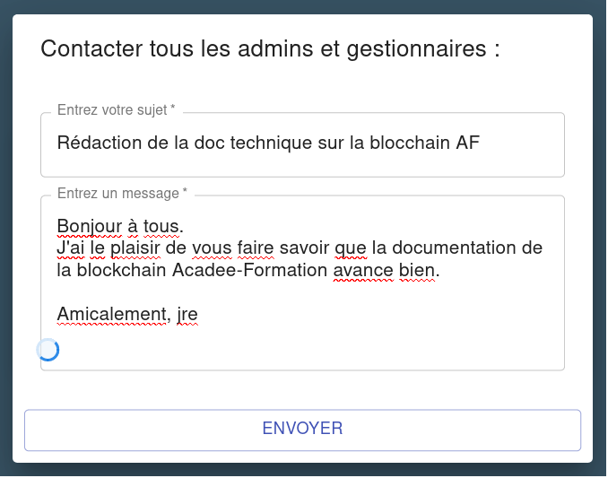
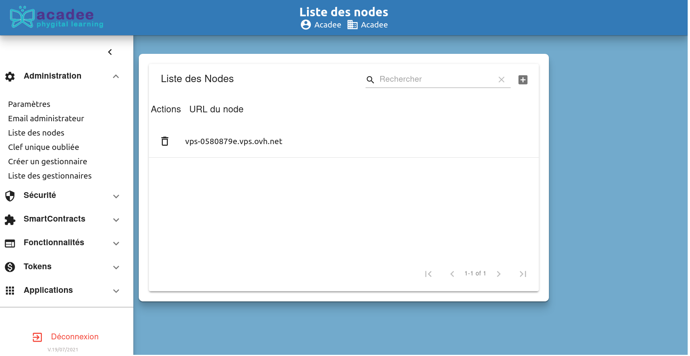
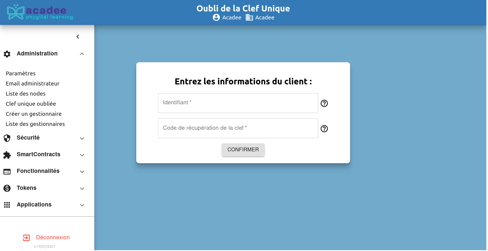
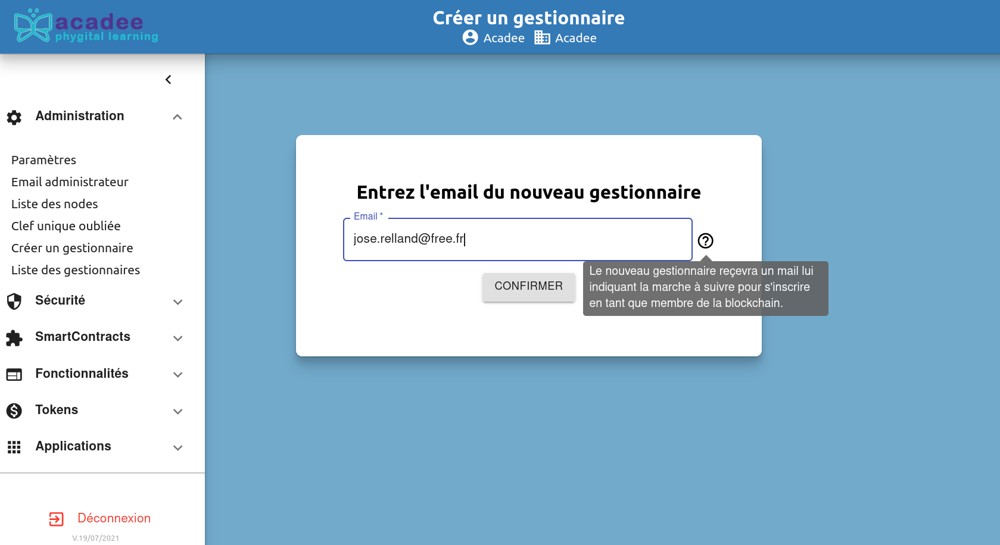
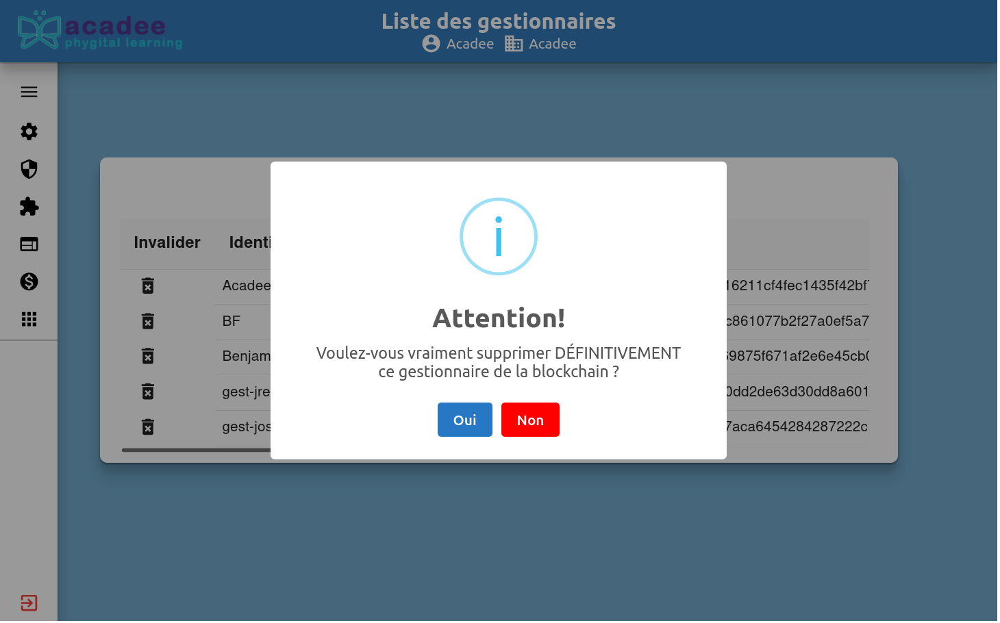

# Détails des commandes du sous-menu Administration


À noter que certains champs proposent de l'aide en ligne en cliquant sur l'icône ❔


## Paramètres

Cet écran permet à l'**administrateur de consulter et de modifier** \(en cliquant sur le crayon\) les paramètres généraux du serveur de ce node de la blockchain Acadee-Formation.

Pour visualiser l'ensemble des paramètres généraux, utiliser l'ascenseur de l'écran central.

## Email administrateur

Permet la modification de l'email administrateur, par l'administrateur lui-même.

Il est possible aussi de contacter tous les administrateurs et les gestionnaires.

Cliqer sur \`CONTACTER TOUS LES ADMINISTRATEURS\`

Dans un premier temps, la liste apparaît.

En cliquant sur \`ok\`, une boîte apparaît pour la rédaction et l'envoi du message.

Cliquer sur \`Envoyer\`, les personnes listées vont recevoir ce message.

## Liste des nodes

Cette commande fait apparaître la liste des nodes de cette blockchain. À noter que pour la blockchain pédagogique Acadee-Formation, il y a qu'un seul node.

À noter que l'administrateur pour supprimer un node à partir de cet écran. Cela peut-être nécessaire si il apparaît que ce node a été corrompu.


À noter que la destruction d'un node n'a aucune conséquence sur la blockchain. Les registres sont sauvegardés sur les autres nodes. Il suffirait donc de réinstaller le serveur, de restaurer les accès des différents utilisateurs et de partager à nouveau les registres pour réinstaller ce node.


## Clef unique oubliée

Nous vous recommandons de bien conserver votre clé unique. Dans le cas de la perte de votre clé unique, contacter l'administrateur ou le gestoinnaire.

## Créer un gestionnaire

Pour créer un gestionnaire, l'administrateur entre l'adresse e-mail dans ce champ. La personne destinataire reçoit les instructions à suivre pour devenir gestionnaire.

Comme déjà évoqué, le gestionnaire ne devra pas perdre sans clé unique.

Pour la suite du processus de création du gestionnaire, voir la page Les gestionnaires.

## Liste des gestionnaires

La liste des gestionnaires créé par l'administrateur apparaît ici. Un gestionnaire peut être vacilement supprimé par l'administrateur, en cliquant sur l'icône de la corbeille.

Les statuts d'Administrateur et de Gestionnaires sont affichés.

### A propos de la colonne Empreinte

Une "empreinte" lisible est indiquée pour chaque utilisateur. Cette empreinte est votre identification dans les registres de la blockchain. Chaque des actions que vous inscrirez dans la blockchain \(comme acheter des tokens\) portera cette empreinte pour vous identifier.

Mais cette empreinte n'est ni un mot de passe ni une clé unique qu'une personne pourra utiliser à votre insu dans la blockchain.

Pour que votre "empreinte" soit **reconnue** lors des transactions dans la blockchain, il est nécessaire de disposer de votre **clé unique**.

### Suppression d'un gestionnaire.

L'icône de la corbeille permet à l'administrateur de supprimer un gestionnaire. Un écran de rappel vous demande la confirmation de la suppression, puis le gestionnaire est supprimé.

Le sous-menu Administration a été entièrement présenté. La suite de la documentation porte sur la Sécurité. La sécurité est accessible à l'administrateur et aussi au gestionnaire.

