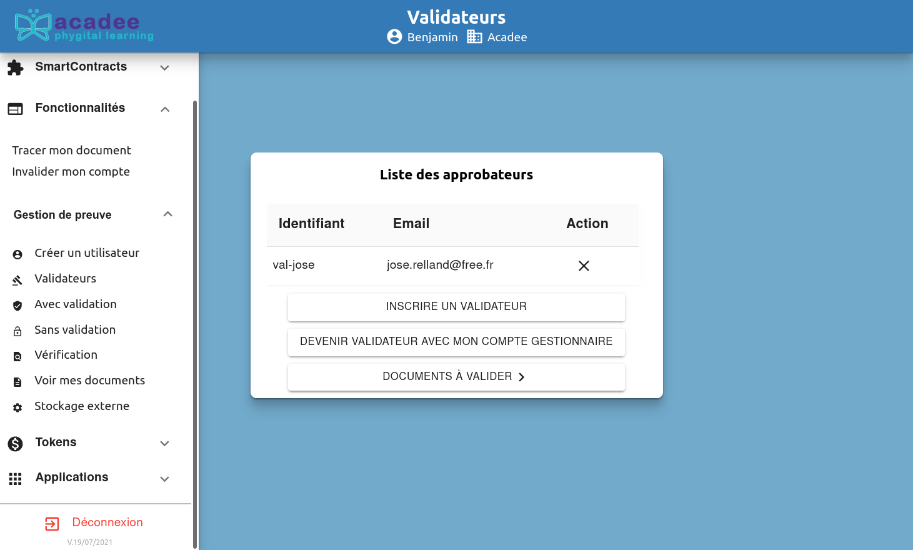
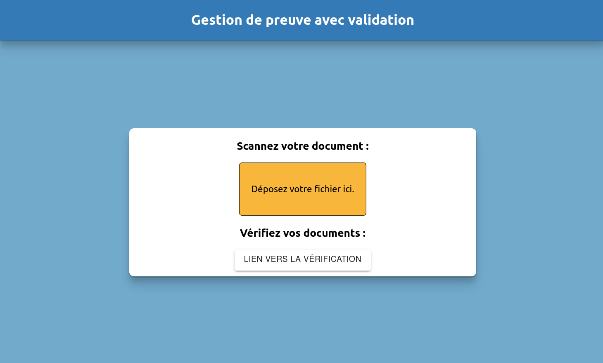
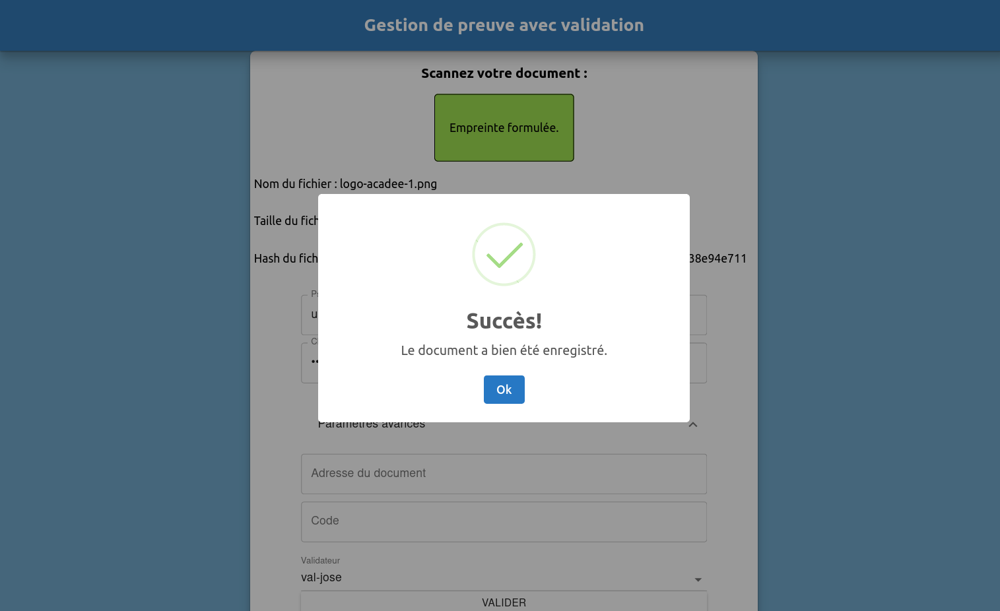

# Gestion de la preuve

## Présentation de la Gestion de la preuve

Le menu Gestion de la preuve permet de réaliser un processus complet d'autentification de documents et leur vérification. Une fois identifié, le document, et uniquement ce même document au même format, sera identifiable dans la blockchain Acadee-Formation. Son propriétaire, celui qu'il l'a identifier, pourra aussi démonter sa propriété.

Le sous-menu Gestion de preuve, dans la rubrique Fonctionnalités. Voir le sous-menu de gauche. L'écran ici est celui des Validateurs.

## Créer un utilisateur

Voir le chapitre [Les utilisateurs](../acteur/utilisateur.md)

## Validateurs

Voir le chapitre [Les validateurs](../acteur/validateur.md)

## Avec validation

Avec validation permet de faire authentifier un document avec une ou plusieurs tierces personnes.

Le processus est le suivant : une fois que l'utilisateur du document a authentifié, celui-ci est envoyé au vérificateur qui a été choisi. Une fois que le vérificateur à valider le document, le processus s'achève et le document est authentifier. Si le validateur refuse la validation, le processus repart au début.

Note : Il est possible d'authentifier un document sans validation. Voir le chapitre suivant.

Le document à authentifier est à glisser sur le carré jaune centrale.

En cliquant sur le bouton jaune, il est possible de sélectionner son document en naviguant dans le navigateur de fichiers.

Le document à authentifier est le logo de Acadee-Formation au format .png.

Une fois détecté, le fichier est traité localement. L'encadré devient vert. Des informations liées au fichier apparaissent. Il est important de noter que le contenu du document n'est ni "copié" ni "espionné".

Dans son principe, la blockchain n'a pas vocation à stoker le document. C'est une fonctionnalité additionnelle proposée par la plateforme Acadee-Formation. Voir plus loin.

Note sur le Hash : Le hash est une suite de caractères associé au "format" du document lui-même. Ce hash sera un élément de l'authentification finale.

En bas de l'écran centrale, deux sous-menus apparaissent en cliquant sur les chevrons :

* Paramètres avancés (non étudié ici)
* Validateur. C'est ici que vous allez choisir votre validateur.

Les champs Pseudo et Clé de preuve sont ceux d'une personne qui a été déclarée comme utilisateur comme vu plus haut. De même, la liste des validateurs est la liste des personnes qui été déclarées comme validateur comme vu plus haut.

.png>)

Cliquer sur valider pour envoyer le processus d'authentification vers le validateur.

## Sans validation

## Voir mes documents

Pour voir les documents stockés, aller dans Fonctionnalités > Gestion de la preuve > Voir mes documents, Dans le navigateurs de fichiers, sélectionner votre documents selon l'arborescence proposés. Cliquer sur votre fichier pour voir apparaître le contenu du fichier.

 (2) (3) (3).png>)

À l'aide des quatre icônes en haut à droite de la fenêtre centrale, il est possible, pour les documents listés dans le sous-répertoire :

* De tout sélectionner
* De supprimer le ou les documents sélectionnés. Cela supprimera le document ou les documents du node mais pas son empreinte dans la blockchain.
* Partager à d'autres nodes. Le ou les documents sélectionnés seront disponibles sur touts les nodes.
* Télécharger. Le ou les documents sélectionnés pourront être téléchargés.

Exemple avec&#x20;

## Stockage externe
