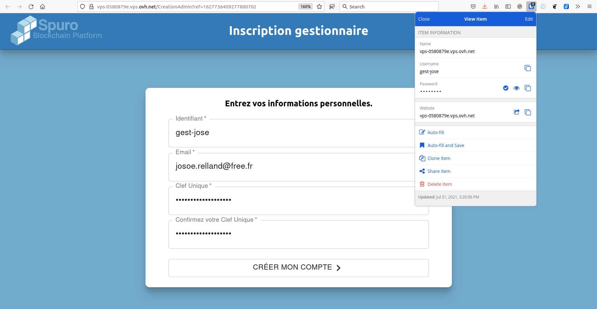
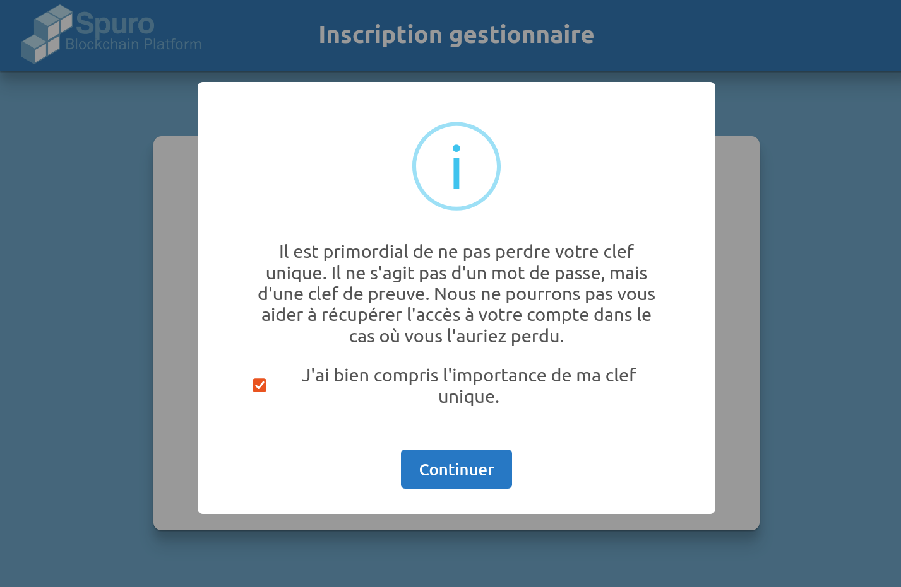
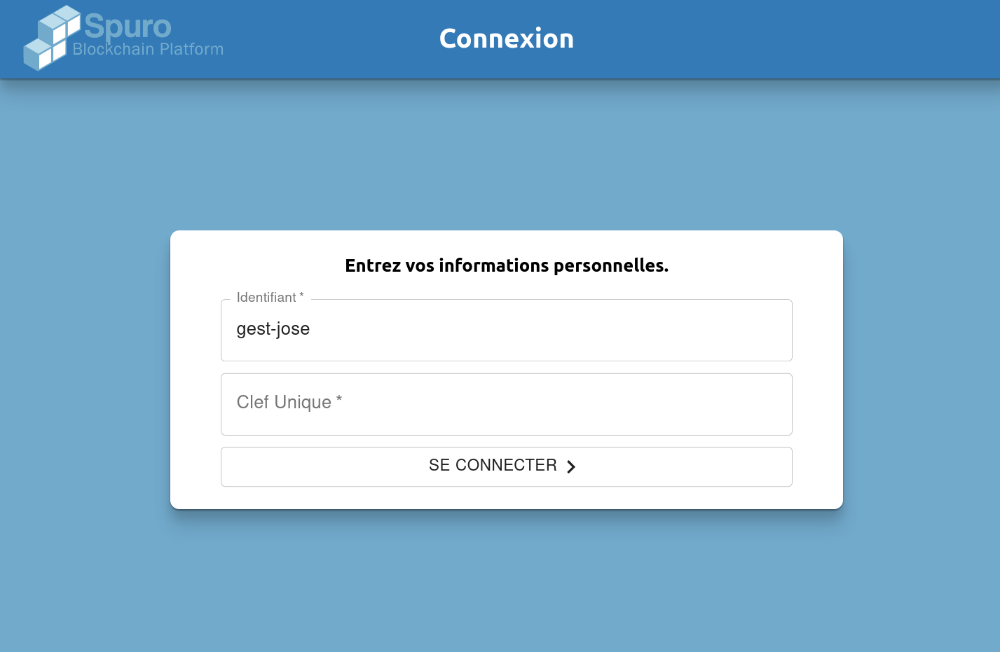
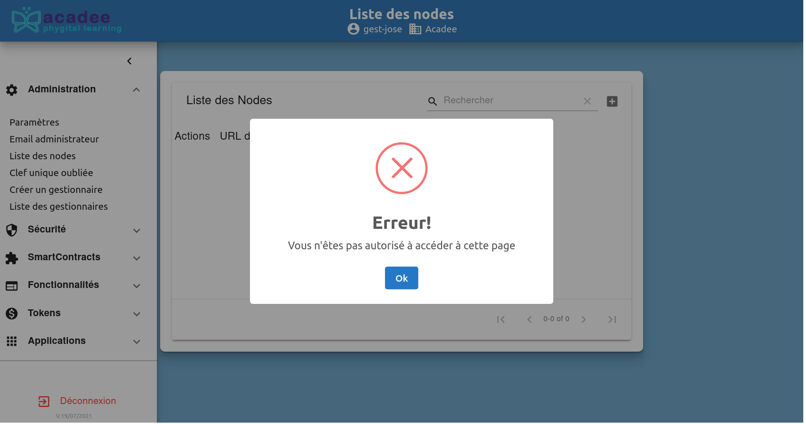

# Les gestionnaires

## Le processus de création d'un gestionnaire, initié uniquement par l'administrateur, débute par l'envoi d'un email à la personne concernée. Le futur gestionnaire complétera seul de le processus.Rôle du gestionnaire

Le gestionnaire est la \(ou les\) personne qui gère le site du point de vue des usages.

Le gestionnaire dispose de moins de fonctions que l'administrateur mais plus que l'utilisateur.

Le gestionnaire à un rôle important, c'est lui qui **créé les utilisateurs**. Il va aussi autoriser certaines applications ou les retirer du menu.

Le gestionnaire reste sous la dépendance de l'administrateur.

## Création un gestionnaire

Le gestionnaire est créé par l'administrateur. Pour plus de détails, voir le chapitre Détails des commandes du sous-menu Administration.

Le processus côté gestionnaire comme avec l’e-mail suivant :

> **Bonjour,**
>
> Un administrateur de la blockchain vous a ajouté en tant que gestionnaire,
>
> Pour confirmer votre inscription veuillez vous rendre sur le lien suivant : [lien vers l'inscription](http://vps-0580879e.vps.ovh.net/CreationAdmin?ref=1627736409277800702) et remplir les champs demandés.
>
> Cordialement.
>
> **Spuro**

Cliquer sur le \`lien vers l'inscription\` pour compléter l'inscription. Un écran permet d'enregistrer les données liées au futur Gestionnaire.


Il est recommandé d'enregistrer vous information d'abord dans votre gestionnaire de mots de passe ou votre wallet. Ensuite, utiliser cet outil pour documenter l'enregistrement. Vous serez assuré d'avoir


Documenter les champs, idéalement avec un outil, puis cliquer sur \`CRÉER MON COMPTE.

Un Rappel s'affiche, cocher la case \`J'ai bien compris ...\` et cliquer sur \`Continuer\`

Votre compte de gestionnaire a été créé à par le processus enclenché par le lien dans l'email.

À noter que ce processus s'est déroulé sans l'administrateur. Ce dernier ayant uniquement inité le processus de création du gestionnaire avec seulement l'email du futur gestionnaire.

L'administrateur ne connaît pas les données du gestionnaire.

L'écran de connexion de connexion s'ouvre, le gestionnaire peut entrer ses données de connexion.

L'écran d'accueil du gestionnaire apparaît.

Voir dans le bandeau supérieur l'identifiant du gestionnaire.

À noter que même si le menu Administration est visible, toutes les commandes de l'administration ne sont pas accessibles au gestionnaire. Un message d'erreur apparaît si il veut en activer une.

Exemple avec la commande \`Liste des notes\`

## Liste et suppression des gestionnaires

La liste des gestionnaires ainsi que la suppression d'un gestionnaire ne peut être faite que par l'administrateur. Pour plus de détails, voir le chapitre [Détails des commandes du sous-menu Administration](../admin-securite/details-des-commandes-du-sous-menu-administration.md).

## Commandes accessibles aux gestionnaires

Toutes les commandes sont accessibles aux gestionnaires en dehors des commandes du sous-menu Administration.

Voir le détails de ces commandes dans les pages concernées.

