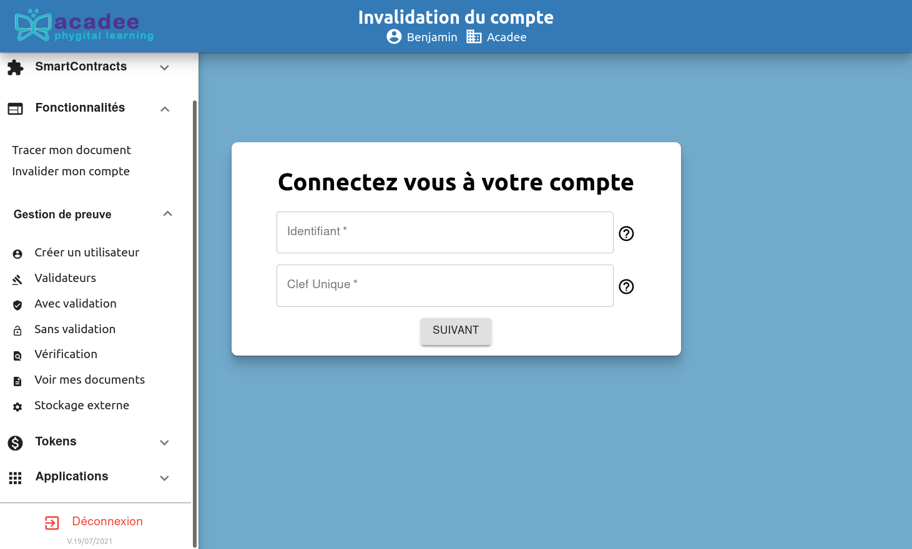

# Les utilisateurs

## Rôle des utilisateurs

Les utilisateurs sont les utilisateurs finaux d'une blockchain. Dans le cas de la tokénisation d'une bouteille de Pétrus \(voir le dernier chapitre\), les utilisateurs seraient les spéculateurs.

En fonction des applications qu'ils ont à leur disposition, les utilisateur auront à leur disposition des application dans la blockchain.

## Création d'un utilisateur

Les utilisateurs sont créés par les gestionnaires. Les administrateurs peuvent aussi gérer les utilisateurs.


Prochainement, les comptes utilisateurs seront créés par l'utilisateur lui-même, comme pour les gestionnaires.


Dans Fonctionnalités &gt; Gestion de preuve &gt; Créé un utilisateur, remplir les différents champs.

Après avoir validé l'écran de validation en cochant la case, l'écran de succès apparaît. Un nouvel utilisateur a été créé.

Lorsque l'on créé des utilsateurs \(et autres rôles\) avec un pseudo existant, le message suivant apparaît. En cliquant sur le bouton OK, retour à l'écran contenant les champs à remplir.

## Liste et suppression d'utilisateur


La fonction n'est pas encore implémentée comme elle l'est pour les gestionnaires et les


### Invalider mon compte

Dans Fonctionnalités &gt; Invalider mon compte, il est possible d'invalider son compte.

Entrer les identifiants dans l'écran proposé

Confirmer l'invalidation en entrant "INVALIDER" dans le champ texte.

