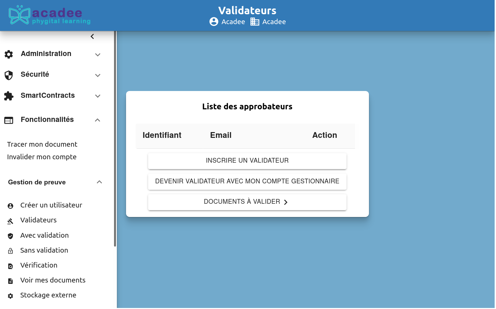
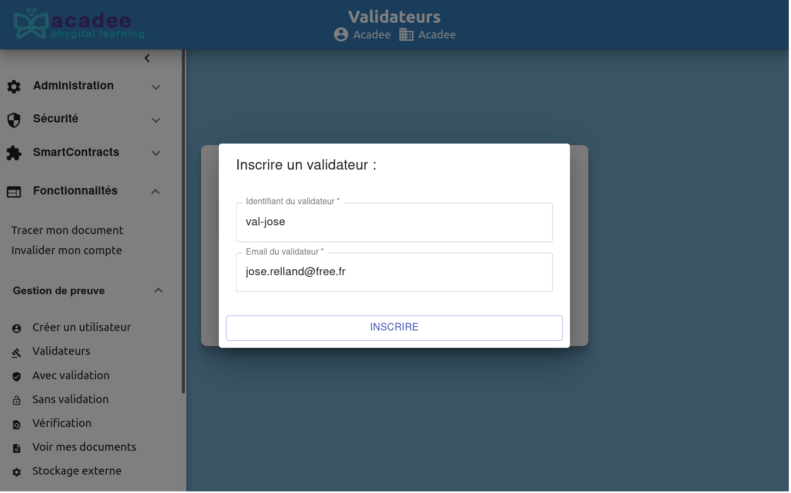
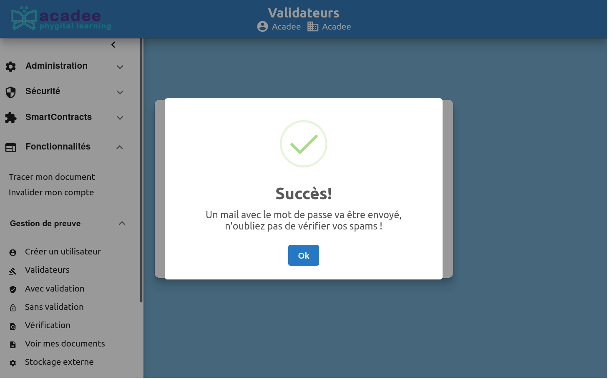
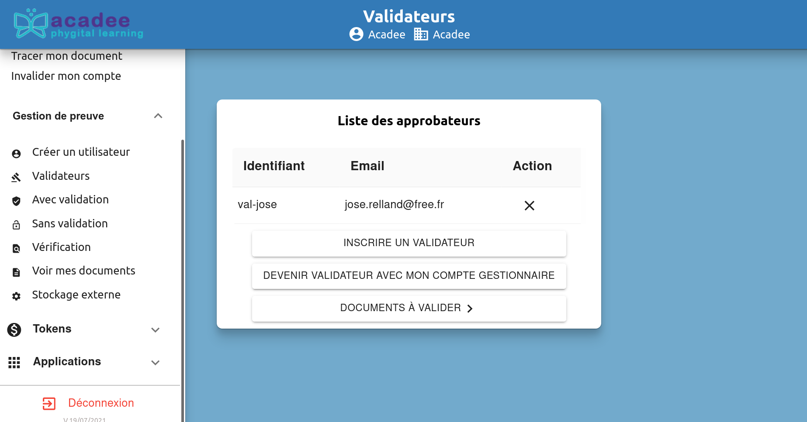
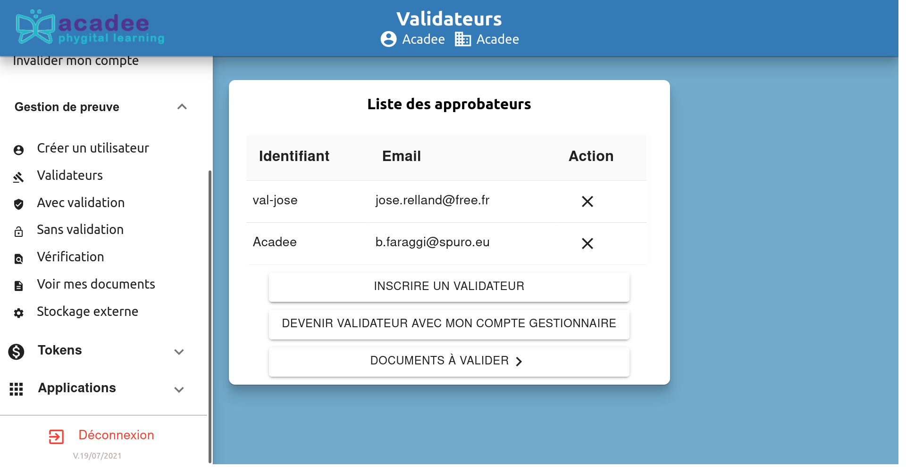

# Les validateurs

### Rôle des validateurs

Le processus de Gestion de la preuve de la blockchain peut demander la validation d'un document, autres, par une tierce personne. C'est le valideur qui tient cette fonction de validation. À noter que la gestion de la preuve peut se faire avec ou sans validateur.

Un valideur ou plusieurs validateurs doivent être créés par le gestionnaire ou par l'administrateur.

Un gestionnaire peut demander aussi à être un validateur.

### Création d'un validateur

Le validateur est créé par le gestionnaire avec la commande Fonctionnalités &gt; Gestion de la preuve &gt; Validateurs.

Dans la création d'un validateur, il existe deux possibilités :

1. INSCRIRE UN VALIDATEUR

Un écran confirme le succès

Un email a été envoyé qui confirme la création et indique la clé de preuve. Le destinataire doit donc confirmer le statut de validateur.

> **Bonjour,**
>
> Un administrateur vient de vous ajouter en tant que validateur.
>
> Votre identifiant est : val-jose
>
> Votre clef de preuve est : 9dy1affa, vous pourrez la changer dans la page des validations : [Validations en attente](http://vps-0580879e.vps.ovh.net/KageSecure/SignatureCollaborative/Fonctionnalités/GestionDePreuve/Validation).
>
> Cordialement.
>
> **Spuro**

    En cliquant sur Validations en attente, vous êtes automatiquement accepté.

Retour dans l'écran Validateurs, le nouveau validateur apparaît. La clé de rpreuve doit être gardée.

2. DEVENIR VALIDATEUR AVEC MON COMPTE GESTIONNAIRE

En cliquant sur ce bouton, le compte qui est ouvert, gestionnaire ou administrateur, devient automatiquement un validateur. Dans l'exemple ci-dessous, le compte était Acadee, il se retrouve désormais dans la liste.

###  Suppression d'un validateur

Le validateur peut être facilement supprimé en cliquant sur la croix à droite de son nom par le gestionnaire ou le validateur.

Il n'y a pas d'écran de confirmation.

###  Rôle du validateur

Voir le détail de ce rôle dans les fonctionnalités transversales :[Fonctionnalités]() &gt; Gestion de la preuve.

