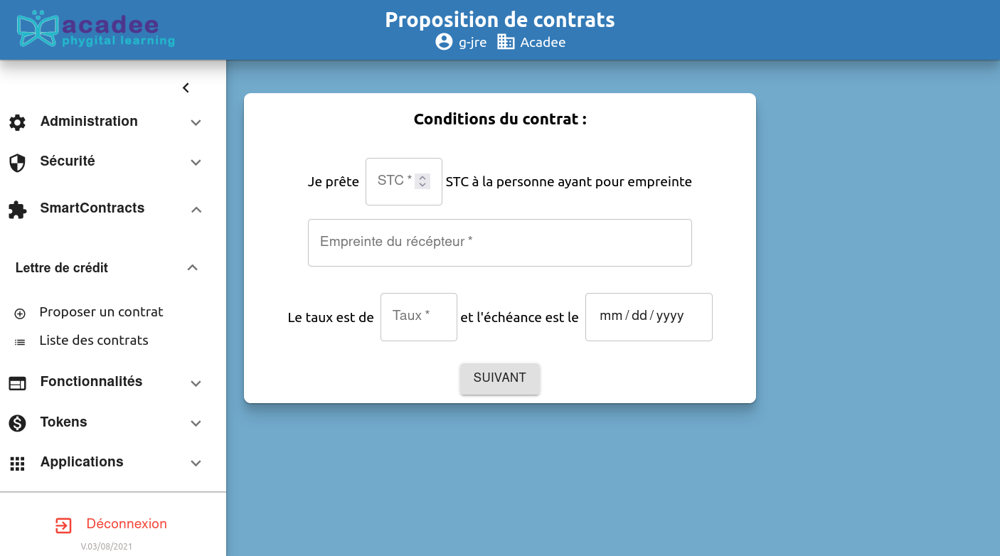
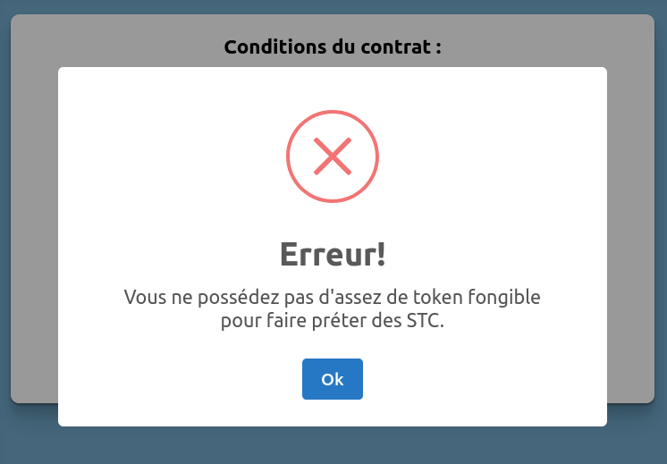

# Smart Contracts

## Présentation des smart contracts

## Lettre de crédit

### Proposer un contrat

Les propositions de contrat sont à élaborer dans cet écran. Actuellement, le contrat porte uniquement sur un prêt de STC une personne appelée ici le "récepteur".


Avant d'élaborer les conditions du smart contract, il est nécessaire de vérifier que le prêteur dispose bien de ces STCs. Dans le cas contraire, le contrat ne sera pas finalisé.


Message d'erreur en cas d'insuffisance de tokens à préter.

### Liste des contrats

