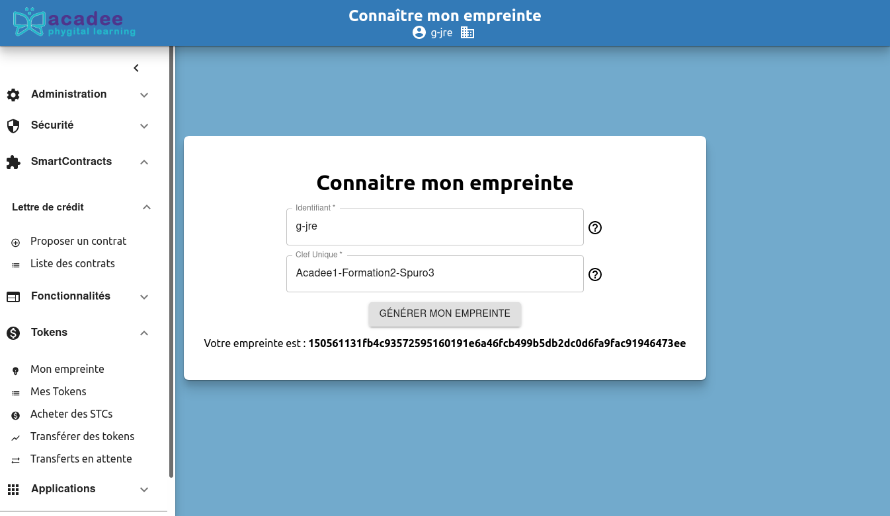
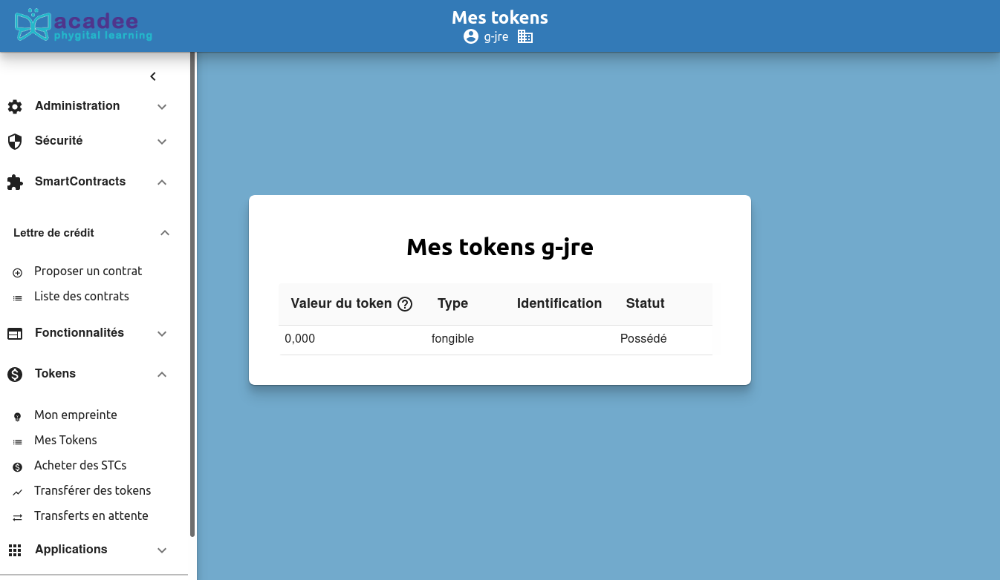
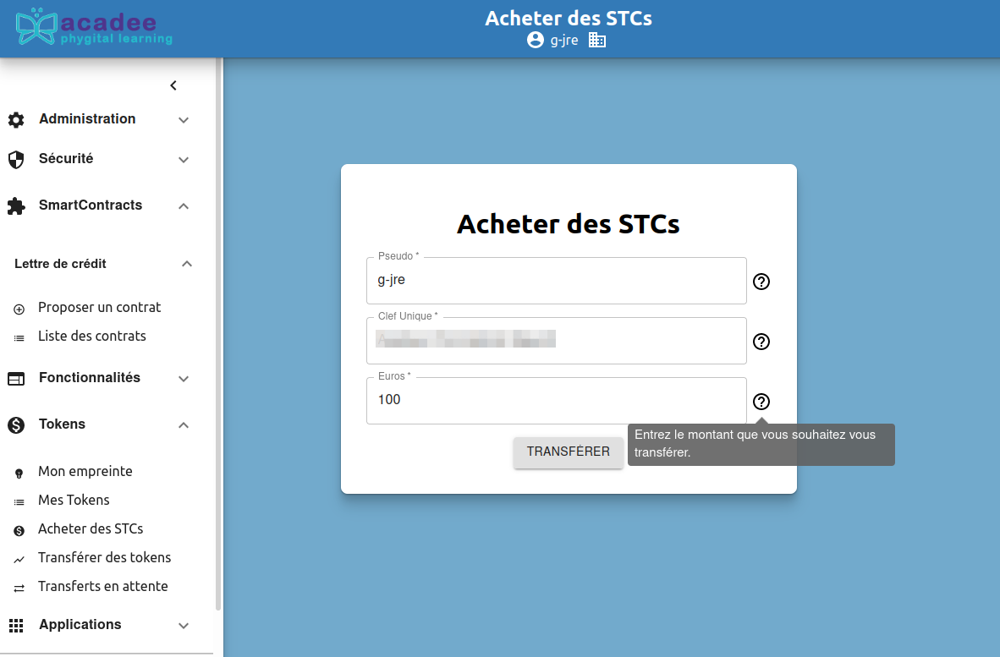
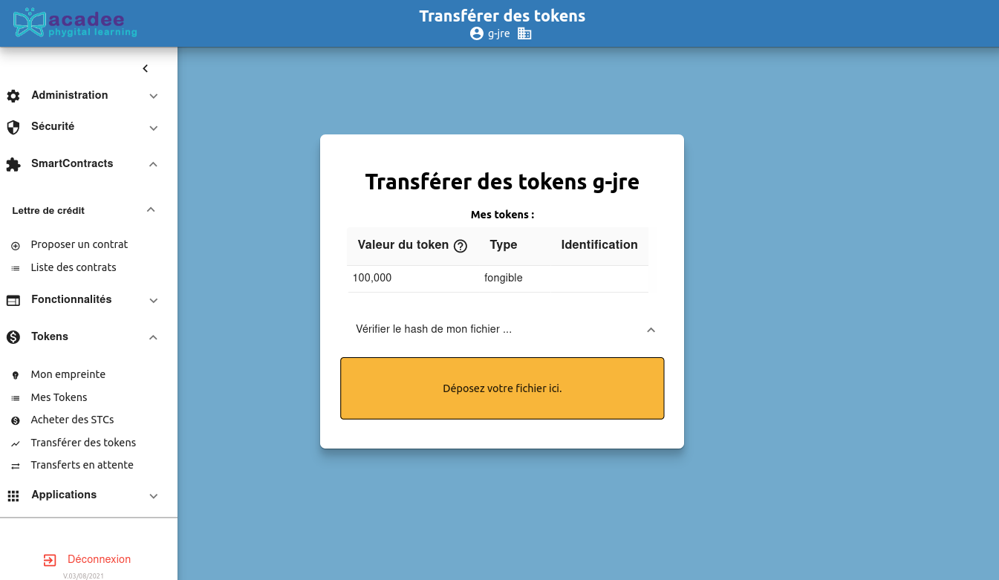
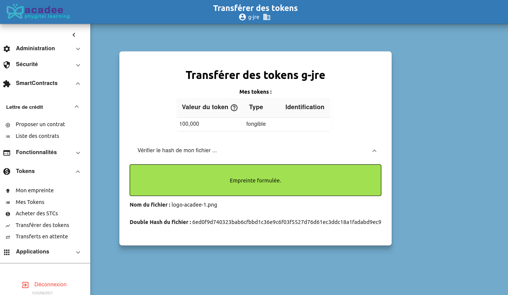

# Tokens

## Présentation des tokens

C'est la menu tokens qui sera utilisé pour le jeu de la tokenisation de la bouteille de Pétrus.

## Mon empreinte

Cet écran permet de connaître son empreinte afin de vous faire des opérations dans la blockchain lorsque celle-ci est requise. Par exemple, lors de l’empreint de tokens, l'empreinte du "receveur" est demandée.

Il est important de distinguer la clé unique \(qui agit comme un identifiant d'accès à la blockchain\) et l'empreinte qui est un hash qui vous identifie dans la blockchain.

 Cette empreinte doit restée confidentiel. Il n'est pas nécessaire de la sauvegardée, elle sera toujours accessible sur la blockchain à partir de votre compte.

## Mes tokens

L'écran qui vous indique vos tokens

## Acheter des STCs

Dans Tokens &gt; Acheter des tokens, après votre identification, acheter des tokens. Un euro égale 1 STC. 

À noter qu'ici l'achat est fictif 😊.

Après l'écran Succès,  cliquer sur OK. Pour vérifier le versement, retourner sur Mes tokens. La valeur de vos tokens sont affichée avec 3 décimales.

## Transférer des tokens

Dans Tokens &gt; Transférer des tokens, le transfert de vos tokens commence par la vérification du hash de votre fichier ???

Glisser votre fichier dans la zone orange. Ou cliquer sur la zone orange et sélectionner votre fichier dans le navigateur de fichiers.

Cliquer sur le bouton vert Empreinte formulée.

## Transferts en attente

